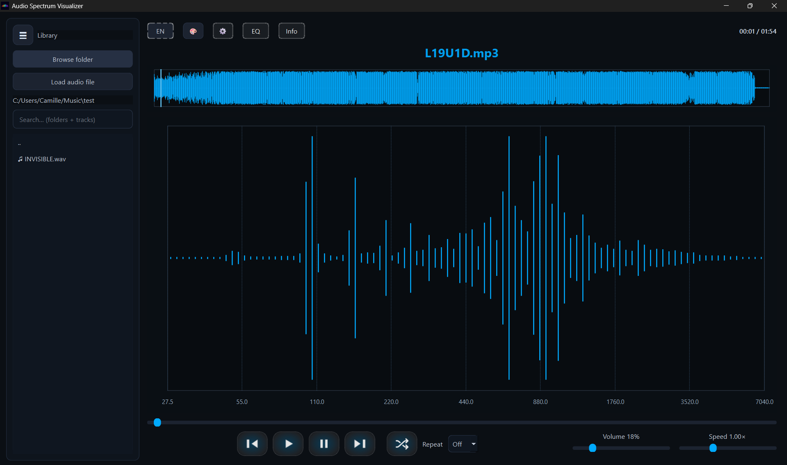

<h1 align="center">Real-time Audio Spectrum Visualizer</h1>

  
  <h4 align="center">
    inspired by <a href="https://github.com/mozhewen/spectrum">Mozhewen's spectrum</a>
  </h4>

---

# Audio Spectrum Visualizer – Music Player

A desktop **music player with a real-time audio spectrum visualizer**.
The project focuses on combining audio playback with a clean interface and live visual feedback based on the currently playing sound.

## Features

- Play local audio files (WAV, and others depending on backend)
- Music library panel on the left
- **Resizable sidebar**, with width saved between menu actions
- Waveform display of the loaded audio
- **Real-time frequency spectrum visualization**
- Playback controls (play, pause, stop, seek)
- Volume and playback speed control
- Persistent user settings (themes, music folder, music running, etc... (look inside parameter button)

## Interface Overview

- **Left panel**: library and file navigation  
- **Top area**: languages, parameters, equalizer access, waveform  
- **Center panel**: real-time spectrum analyzer  
- **Bottom bar**: playback controls, time, volume, speed  

The spectrum reacts live to the currently playing audio.

