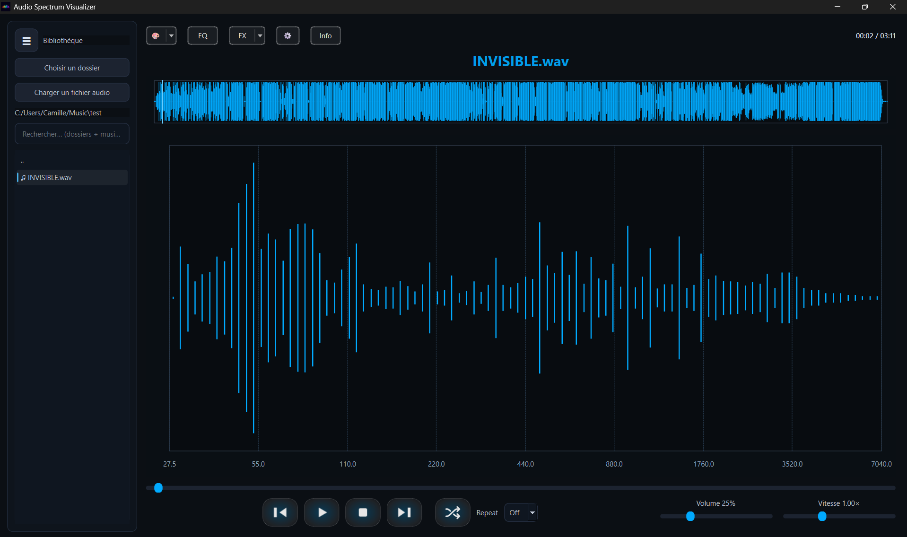

<h1 align="center">Audio Spectrum Visualizer – Music Player</h1>

  
  <h4 align="center">
  </h4>

---

<h4 align="center">
  <a href="#features">Features</a>
   | 
  <a href="#interface-overview">Interface</a>
   | 
  <a href="#settings">Settings</a>
   | 
  <a href="#audio-files-supported">Files Supported</a>
   | 
  <a href="#spectrum">FX</a>
   | 
  <a href="#spectrum">Equalizer</a>
   | 
  <a href="#os-build">OS-Build</a>
   | 
  <a href="#references">References</a>
   | 
   <a href="#demo">Demo</a>
   | 
</h4>

---

A desktop **music player with a real-time audio spectrum visualizer**.
The project focuses on combining audio playback with a clean interface and live visual feedback based on the currently playing sound.

The spectrum reacts live to the currently playing audio.

## Features

- Play local audio files (WAV, and others depending on backend)
- Music library panel on the left
- **Resizable sidebar**, with width saved between menu actions
- Waveform display of the loaded audio
- **Real-time frequency spectrum visualization**
- Playback controls (play, pause, stop, seek)
- Volume and playback speed control
- Persistent user settings (themes, music folder, music running, etc... (look inside parameter button)

## Interface Overview

- **Left panel**: library and file navigation  
- **Top area**: color themes, settings, equalizer access, waveform  
- **Center panel**: real-time spectrum analyzer  
- **Bottom bar**: playback controls, time, volume, speed  

## Settings

The **Settings** panel allows you to customize the player’s behavior, appearance, audio engine, and spectrum visualization.  
All settings are persistent and restored on the next application launch.

### General

| Option    | Description |
|----------|-------------|
| Language | Select the application language from the available options. |
| Theme    | Choose a color theme for the interface. **Rainbow speed** controls the animation speed when using a dynamic/rainbow theme. |

### Startup

Configure how the application behaves on launch:

- **Autoplay on start**: Automatically start playback when the app opens.
- **Resume last track**: Reload the last played track.
- **Remember playback position**: Continue playback from the exact position where it was stopped.

### Interface

| Option | Description |
|------|-------------|
| UI scale | Adjust the global interface scaling. |
| Library opened on start | Automatically open the music library panel on startup. |
| Remember sidebar width | Restore the sidebar width between sessions. |

### Music Folder

- Select the default folder used to scan and load local music files.
- The music library updates based on the selected directory.

### Audio

| Option | Description |
|------|-------------|
| Default volume | Initial volume level on startup. |
| Fade in/out (ms) | Smooth audio transitions when starting or stopping playback. |
| Audio output | Select the audio output device. |
| Buffer size | Adjust audio buffering for stability versus responsiveness. |
| Latency | Choose the desired latency mode. |
| Sample rate | Use the audio file’s sample rate or force a specific value. |

### Spectrum

| Option | Description |
|------|-------------|
| Mode | Choose between linear or logarithmic frequency scaling. |
| Sensitivity | Adjust how strongly the spectrum reacts to audio. |
| Responsiveness | Control how quickly the spectrum updates. |
| Gamma | Modify brightness and contrast of the visualization. |
| Percentile | Normalize spectrum peaks for better visual balance. |
| Show waveform | Display the waveform alongside the spectrum analyzer. |

### Reset

- **Reset** restores all settings to their default values.
- Changes can be confirmed with **OK** or discarded with **Cancel**.

## Audio Files Supported
- WAV 
- FLAC
- OGG / Vorbis
- AIFF / AIF
- MP3
- M4A
- AAC
- OPUS
- WMA

Both mono and stereo files are supported.
Sample rates are handled automatically or can be overridden in settings.

## FX 
- Off – No processing
- Reverb 
- Echo
- Vibrato
- Chorus 
- Flanger 
- Tremolo 
- Overdrive 
- Bitcrusher 

## Equalizer
A built-in 10-band graphic equalizer.

## OS-Build

| OS | Download |
|---|---|
| Windows 10 or above |   |
| Mac |     |

coming soon...

## References

  <h4>  - Inspired by <a href="https://github.com/mozhewen/spectrum">Mozhewen's spectrum</a> and the monotony of Windows Media Player.</h4>

## Demo
[First Demo](vid/version1.0.41) (comming soon)
